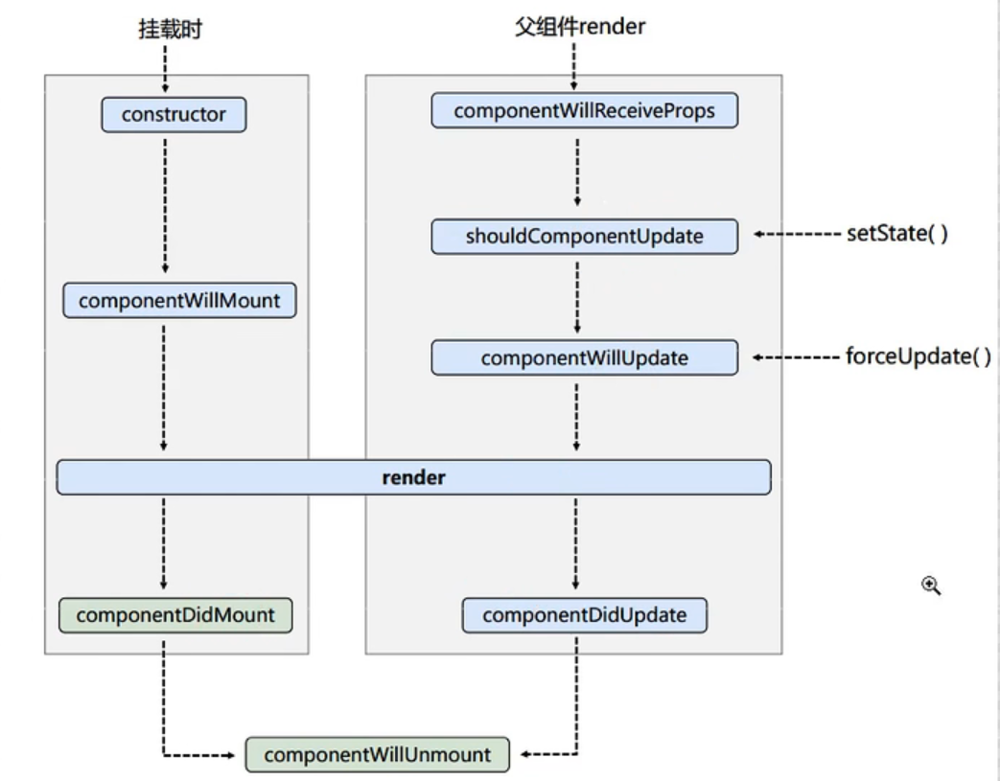
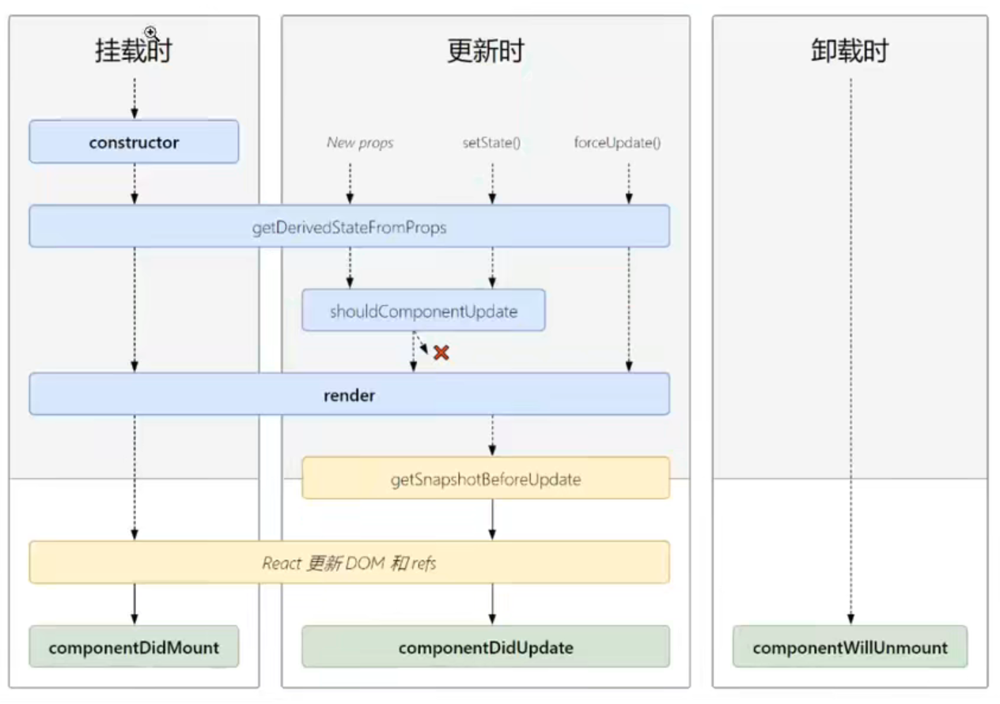

# 03-组件

组件化，即将要实现的页面划分为若干模块，个模块分别用组件实现

此时，明确了各部分的实现内容

对于结构相同的模块，可以抽取出相同的组件，仅需要更改参数，做到代码复用

乃至更进一步的，对布局、UI结构抽取出同一个组件，将子组件视为参数传入，实现代码复用，即插槽

组件的实现：2种方式

## 函数组件

函数组件又称 无状态组件 ，即不进行状态管理

此时，该函数是一个纯函数，不会引起副作用（改变外界变量），且输出只依赖于输入

即，函数组件是一个 无状态管理的，通过输入 `props` 直接控制显示的组件。

相比于类组件，函数组件无状态管理、无生命周期，但比类组件更灵活、更轻

在 React 16.8 版本，推出的 hooks 解决了函数式组件的 状态管理 和 生命周期 问题

例：

```jsx
import React from 'react'

export default function App() {
  function handle() {}
  return (
    <div>App</div>
  )
}
```

## 类组件

```jsx
import React, { Component } from 'react'

export default class App extends Component {
  render() {
    return (
      <div>App</div>
    )
  }
}
```

要求：

- 继承 `Compononet`
- 实现 `render()`
- 类名的首字母大写

### render方法中的this

使用 `React.render()` 方法渲染类组件时，先创建一个组件实例，并 $\textcolor{red}{由react调用}$ 实例的 `render` 方法。

此时，实例对象的 `render()` 方法是 通过实例对象 调用的，因此，其中的 `this = ` 实例对象自身。

注：`this` 的隐式绑定，通过对象调用方法，则方法中的 `this` 指向对象。

### 类组件实例方法中的this

this的4种绑定方式

- 默认绑定：独立调用函数时，取决于其环境
- 隐式绑定：通过对象调用函数时，如 obj.foo()
- 显示绑定：通过 apply/call/bind
- new绑定：通过 new 调用函数生成实例时

组件中实例方法内使用 this 的问题：

实际上，在调用绑定的事件处理函数（处理函数时组件的实例方法）时，是独立调用函数。

解释：

对于类中实例方法 `handle = function() {}`

在 `render` 方法中绑定事件处理函数，是获取到函数对象，当事件触发时，调用此函数。

又，是 react 调用对应的事件处理函数，则此时函数是独立调用；

又，babel默认使用严格模式，则类中实例方法的 `this` 指向 `undefined` ；

因此，不能通过 this 访问组件实例对象的其它信息。

解决办法：

利用箭头函数，向上查找找到实例对象。

2种写法

```jsx
// 直接将实例方法写成箭头函数的样式
handle = () => {}
<button onclick={handle}></button>
```

事件触发时，执行函数 `handle ` ；函数是类的实例方法，且是箭头函数，没有this，因此向上层作用域，即**实例对象本身**，找this，此时 this = 实例对象

```jsx
// 在绑定方法时，使用箭头函数返回this绑定的实例方法
handle() {}
<button onclick={() => this.handle()}></button>
```

事件触发时，执行函数 `() => this.handle() ` ；函数是在render方法中调用的，且是箭头函数，没有this，因此向上层作用域，即**render() 方法的作用域**，找this，此时 this = 实例对象

或在 constructor 中使用bind方法主动绑定 this

```jsx
this.handle = this.handle.bind(this)
```

### 类组件的三大属性

即 state props refs

- state：存储组件的状态，用于存储和更新组件中的（状态）变量
- props：用于获取传入组件的参数
- refs： 用于获取真实的DOM节点

#### 组件状态（state）

描述组件的状态 ---> 即存储组件的（状态）数据，用于展示

> 简单组件：没有状态的组件
>
> 复杂组件：有状态的组件


**定义方式：**

2种方式：

直接在类中定义

```jsx
class Counter extends React.Component {
  state = {}
}
```

在 `constructor()` 中使用 `this.state = {}`

```jsx
class Counter extends React.Component {
  constructor() {
    super()
    this.state = {}
  }
}
```

注意：在同一个组件中同时使用 2 种方式定义 `state` 时，只有在 `constructor` 中定义的 `state` 生效

**修改**

不允许直接修改 `state`

通过 `this.setState()` 修改

此时，可以直接输入对象：

原 `state` 中没有的，会添加到 `state` 对象中；

与原 `state` 不同的，会覆盖原有的值。

```jsx
class Counter extends React.Component {
  // 定义数据
  // 或在constructor() 中使用 this.state = {}
  state = {
    count: 0
  }
  // 定义修改数据的方法
  setCount = () => {
    this.setState({
      count: this.state.count + 1
    })
  }
  // 使用数据 并绑定事件
  render () {
    return <button onClick={this.setCount}>{this.state.count}</button>
  }
}
```

### props

```jsx
class Person extends React.Component {
  render() {
    //props是只读的
    return (
      <ul>
        <li>{this.props.name}</li>
        <li>{this.props.age}</li>
        <li>{this.props.sex}</li>
      </ul>
    )
  }
  //对组件的属性对其进行限制
  static propTypes = {
    name: PropTypes.string.isRequired,
    sex: PropTypes.string,
    speak: PropTypes.function
  }
  //指定默认的标签属性
  static defaultProps = {
    sex: "女",
    age: 18
  }
}
```

小结：

1. props只读
2. 利用类的静态方法实现props的类型限制和默认值

### refs

实际是用于获取真实DOM节点的

#### 字符串式（过时）

直接给标签添加属性 `ref=name` 此时可以通过 `this.refs.name` 获取对应的节点

```jsx
class Dom extends React.Component {
  btnOnClick = () => {
    alert(this.refs.input.value);
  }
  render() {
    return (
      <div>
        <input ref="input" type="text" placeholder="点击弹出" /> 
        <button onClick={this.btnOnClick}>点击</button> 
      </div>
    )
  }
}
```

#### 回调形式

在标签中添加属性 `ref = {foo} `

此时对应的真实DOM节点对象作为函数的参数传入函数

此时可以把节点对象赋给任意变量

```jsx
class Dom extends React.Component{

  state = {isHot:true};
  btnOnClick = () =>{
      alert(this.dian.value);
  }
  btnOnClick2 = () =>{
      this.setState({isHot:!this.state.isHot});
  }
  isRef = (self) =>{
      console.log(self);
      this.dian = self;
      console.log("sss")
  }
  render(){
      //回调形式的ref 在ref中执行回调函数，将自身作为参数传递给回调函数
      return (
          <div>
          <input ref={this.isRef} type="text" placeholder="点击弹出" /> 
              <button onClick = {this.btnOnClick}>点击</button> 
              <button onClick = {this.btnOnClick2}>点击</button> 
          </div>
      )
  }
}
```

内联式：即将函数直接写在 `ref` 的属性上

```jsx
<input 
	ref = { self =>{ this.dian = self;console.log(self) } }
	type="text" 
	placeholder="点击弹出" />;
```

> 此时函数直接写在标签内，但每次更新节点调用render函数时，对应的函数会调用2次（但无关紧要）

仅传入函数对象可以避免

```jsx
<input ref={this.isRef} type="text" placeholder="点击弹出" />;
```

#### createRef

此时，每个 `createRef` 对象只能接收一个真实DOM节点对象，存储在 `current` 属性中。

给一个 createRef 重复赋值，后添加的会覆盖之前的

```jsx
class Dom extends React.Component {
  MyRef1 = React.createRef();
  MyRef2 = React.createRef();

  btnOnClick = () => {
    //创建之后，将自身节点，传入current中
    console.log(this.MyRef1.current.value);
    //alert(this.refs.dian.value);
  }
  inputBlur = () => {
    //alert(this.MyRef2.current.value);
  }
  render() {
    return (
      <div>
        <input ref={this.MyRef1} type="text" placeholder="点击弹出" /> 
        <button onClick={this.btnOnClick}>点击</button> 
        <input ref={this.MyRef2} 
			onBlur={this.inputBlur} 
			type="text" 
			placeholder="失去焦点弹出弹出" />
	  </div>
    )
  }
}
```

### 事件处理

1. 通过 `onXxx` 属性指定事件处理函数
   - React中使用自定义的事件（onClick），不适用原生事件（onclick）---兼容性
   - React中的事件是通过事件委托方式处理的（委托给组件最外层元素）---高效
2. 通过 event.target 得到事件源的DOM --- 不要过度使用ref

例：当事件源与需要获取DOM节点的标签是同一个时，可以通过event.target获取DOM，避免使用ref

### 关于构造器

在构造器中仅进行2个任务

1. 给state初始化
2. 为事件处理函数绑定实例对象

因：

1. state的初始化可以直接在类中进行
2. 事件处理函数写成箭头函数的形式也可以得到指向实例的this

所以构造器可以省略

另：向构造器传入props的影响：

```js
class Person extends React.Component{
  constructor(props) {
    super(props)
    console.log("this.props",this.props)
    console.log("props",props)
  }
}
```

传入props并给super调用，仅可以使 `this.props` 有值

不将props传入super，`this.props == undefined`

但事实上，在构造器中可以直接通过props访问，在其它处可以访问this.props

## 受控组件

React中的组件分为

将状态变化交由React处理的组件（实现状态双向绑定，单一数据源）

和通过ref引用获取的组件两种（通过DOM操作主动更新存储的状态，导致一个状态有2个数据源），

前者称为受控组件，后者称为非受控组件

### 受控组件（建议使用）

什么是受控组件？  `input框自己的状态被React组件状态控制`

React组件的状态的地方是在state中，input表单元素也有自己的状态是在value中，React将state与表单元素的值（value）绑定到一起，由state的值来控制表单元素的值，从而保证**单一数据源特性**

vue的双向绑定：

传入的参数在组件内部动态绑定（参数在外部的改变，内部组件同步获取）；

同时组件内对数据的改变可以引起外部参数对应变量的改变。

react的受控组件：将变化交由react管理的组件。

以受控表单为例：

```jsx
class InputComponent extends React.Component {
  // 声明组件状态
  state = {
    message: 'this is message',
  }
  // 声明事件回调函数
  changeHandler = (e) => {
    this.setState({ message: e.target.value })
  }
  render () {
    return (
      <div>
        {/* 绑定value （state变化引发input变化） 绑定事件（input变化修改state的值）*/}
        <input value={this.state.message} onChange={this.changeHandler} />
      </div>
    )
  }
}
```

### 非受控组件（不建议）

什么是非受控组件？

非受控组件就是通过手动操作dom的方式获取文本框的值，文本框的状态不受react组件的state中的状态控制，直接通过原生dom获取输入框的值。

此时，状态有2个数据源：DOM操作获取的数据、原state存储的数据。

```jsx
class InputComponent extends React.Component {
  // 使用createRef产生一个存放dom的对象容器
  msgRef = createRef()

  changeHandler = () => {
    console.log(this.msgRef.current.value)
  }

  render() {
    return (
      <div>
        {/* ref绑定 获取真实dom */}
        <input ref={this.msgRef} />
        <button onClick={this.changeHandler}>click</button>
      </div>
    )
  }
}
```

#### 小结

1. `React`中的组件分为受控组件和非受控组件
2. 受控组件的两个要点：
   - 组件的 `value`属性与 `React`中的状态绑定（外界变化 -> 内部变化）
   - 组件内声明了 `onChange`事件处理 `value`的变化（内部变化 -> 外界变化）
3. 非受控组件更像是传统的 `HTML`表单元素，数据存储在 `DOM`中，而不是组件内部，获取数据的方式是通过 `ref`引用
4. 一些建议：
   - 尽可能使用受控组件
   - 受控组件是将状态交由 `React`处理，可以是任何元素，不局限于表单元素
   - 对于有大量表单元素的页面，使用受控组件会使程序变得繁琐难控，此时使用非受控组件更为明智
   - 在受控组件中，数据流是单向的(`state`是变化来源)，因此在改变 `state`时都应该使用 `setState`，而不要强制赋值
   - `Refs`不能用于函数式组件，因为函数式组件没有实例
   - 在函数式组件内部，是可以使用 `Refs`的

作者：卷帘依旧
链接：https://juejin.cn/post/7020980474025607205
来源：稀土掘金

## 生命周期（旧v16.8.4）

$\textcolor{red}{react \ v16.8.4}$



初始化：

1. constructor()
2. componentWillMount()
3. render()
4. componentDidMount()

更新：3种情况：

1. setState()触发更新：
   1. setState()
   2. shouldComponentUpdate()返回true则继续，返回false则停止
   3. componentWillUpdate()
   4. render()
   5. componentDidUpdate()
2. this.forceUpdate()触发
   1. this.forceUpdate()
   2. componentWillUpdate()
   3. render()
   4. componentDidUpdate()
3. 父组件render触发
   1. 父组件render（注意：此处仅当父组件首次render不触发）
   2. componentWillReceiveProps()
   3. shouldComponentUpdate()返回true则继续，返回false则停止
   4. componentWillUpdate()
   5. render()
   6. componentDidUpdate()

卸载组件：

1. componentWillUnmount()

其中常用的：

1. render() 必须使用
2. componentDidMount()
   - 初始化，如：开始计时器、发送网络请求、订阅消息
3. componentWillUnmount()
   - 收尾，如：停止计时器、取消（正在发送的）网络请求、取消订阅

## 生命周期（新v17.0.1）

删除了3个（仍能使用，17版本有警告，需要加 UNSAFE_ 前缀）

- componentWillMount()
- componentWillReceiveProps()
- componentWillUpdate()

新增了2个

- getDerivedStateFromProps()
- getSnapshotBeforeUpdate()



```js
static getDerivedStateFromProps(props, state) {
  console.log("A --- getDerivedStateFromProps", props);
  return null;
}
```

参数： 第一个参数为即将更新的 `props`, 第二个参数为上一个状态的 `state`

返回值：返回一个对象来更新 `state`, 如果返回 `null` 则不更新任何内容

此函数在初始化挂在或，任意更新前都会调用，因此，若返回固定的state，则其中对应的属性不能再更改

小结：

- 必须是静态的
- 必须有返回值（Null或者state对象）
  如果返回的是state对象，将调用setState方法进行更新，且每次都会调用

```js
getSnapshotBeforeUpdate(prevProps, prevState){
  return this.refs.list.scrollHeight;
}

componentDidUpdate(prevProps,prevState,snapshot){
  this.refs.list.scrollTop += (this.refs.list.scrollHeight - height);
}
```

getSnapshotBeforeUpdate(prevProps, prevState)

参数：第一个是上一次props值。 第二个是上一次state值。

返回值：会作为参数snapshot传入componentDidUpdate(prevProps,prevState,snapshot)

应用：

用于获取上次的scrollHeight，自动修改scrollTop

使得在上方插入内容后，保持视口显示当前内容的位置不变

## diff算法（key的作用）

面试题：react/vue中key有什么作用

虚拟DOM中key的作用：

1. key是虚拟DOM的标识，在更新显示时起作用
2. 状态中的数据发生变化时，react会根据【新数据】生成【新的虚拟DOM】，随后进行【新虚拟DOM】与{旧虚拟DOM】的diff比较，规则如下：
   1. 【旧虚拟DOM】中有与【新虚拟DOM】key相同的标签：
      1. 若虚拟DOM的内容一致，直接使用【旧真实DOM】
      2. 若虚拟DOM的内容改变，生成【新真实DOM】并替换
   2. 【旧虚拟DOM】中未找到与【新虚拟DOM】key相同的标签：
      1. 根据【新虚拟DOM】的数据创建【新真实DOM】

用index作为key可能引发的问题：

1. 若对数据进行【逆序】添加、【逆序】删除等【破坏顺序】的操作，此时旧虚拟DOM中有与新虚拟DOM中【内容相同但key不同】的节点，会重新生成，造成效率低
2. 结构中包含输入的DOM，产生错误的DOM更新（输入内容与可以匹配但key发生变化）
3. 但，若不对数据进行【逆序】等破坏顺序的操作，仅用于渲染显示，没有问题
