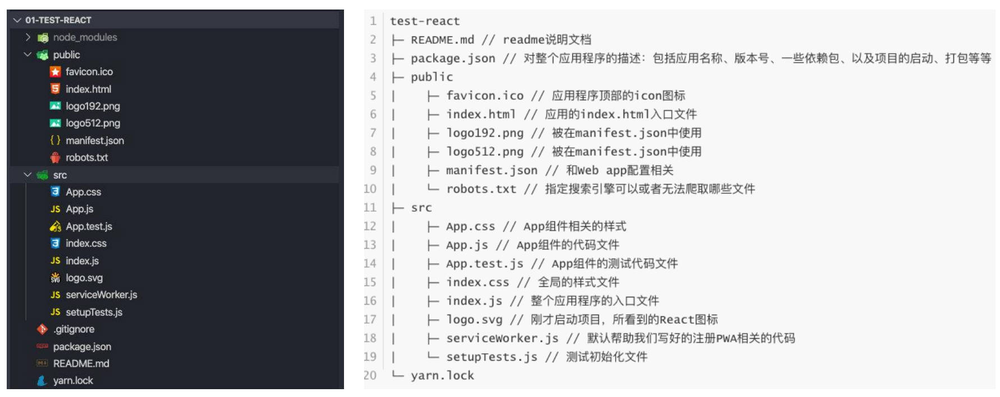

# react脚手架的使用

```node
npx create-react-app test-project
```

`npx create-react-app ` 是固定的命令

`test-project` 是创建的项目的名称，也是在当前路径下，新建的项目文件夹的名称

接下来需要先进入项目文件夹，再启动项目

```node
cd test-project
npm run start
```


## 一般使用脚手架的初始化

删除 `./src` `./public` 的内容

在 `./src` 新建文件 作为项目入口和根组件

`index.js`

```js
import React from 'react'
import ReactDOM from 'react-dom/client'
import App from './App.jsx'

const root = ReactDOM.createRoot(document.querySelector('#root'))
root.render(<App/>)
```

`App.jsx`

```jsx
import React, { Component } from 'react'

export default class App extends Component {
    render() {
        return (
        	<div>App</div>
        )
    }
}
```

注意： `React.render()` 接收标签名时，

首字母大写： 作为组件处理，未引入或未定义，报错

首字母小写： 作为html标签处理，无此标签，报错


## 初始化react项目的文件结构




[关于PWA（渐进式Web应用）]([渐进式 Web 应用（PWA） | MDN (mozilla.org)](https://developer.mozilla.org/zh-CN/docs/Web/Progressive_web_apps)) 

