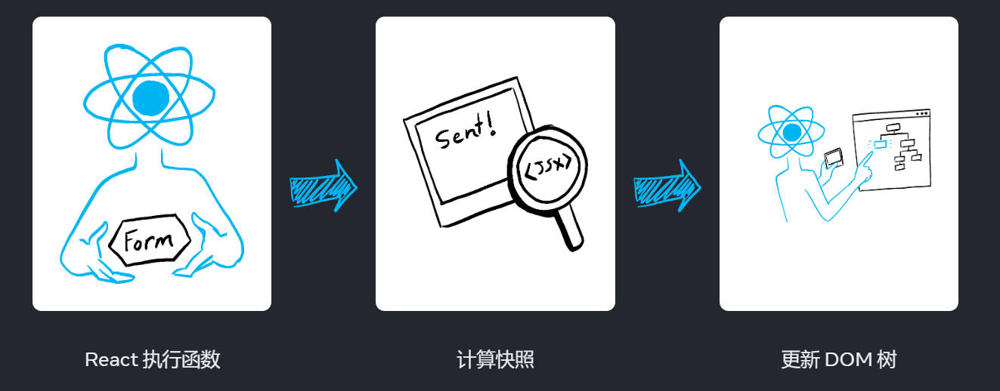
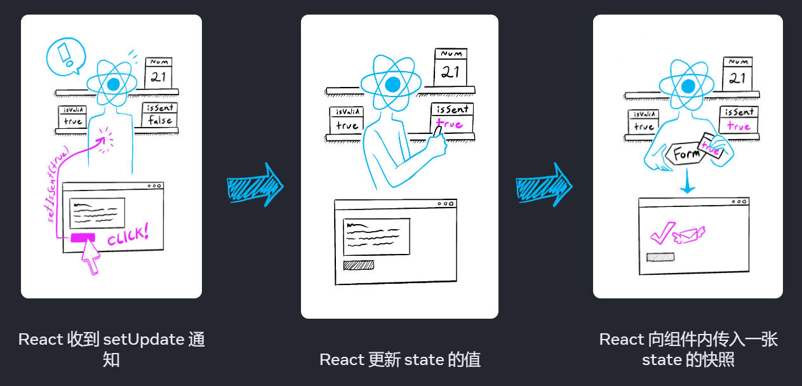

[TOC]

# 0-readme

根据新版官方文档总结

## 1-描述UI

[你的第一个组件 – React](https://zh-hans.react.dev/learn/your-first-component) 

### 1.1-从组件开始

从 HTML标签 到 React组件

```html
<article>
  <h1>我的第一个组件</h1>
  <ol>
    <li>组件：UI 构成要素</li>
    <li>定义组件</li>
    <li>使用组件</li>
  </ol>
</article>
```

```react
<PageLayout>
  <NavigationHeader>
    <SearchBar />
    <Link to="/docs">文档</Link>
  </NavigationHeader>
  <Sidebar />
  <PageContent>
    <TableOfContents />
    <DocumentationText />
  </PageContent>
</PageLayout>
```

React 万物皆组件

即 React 通过复用组件的方式描述整个页面

- 将整个页面分块实现，每块只负责单一的功能
- 抽取的组件，即页面元素可以复用


用 HTML 类比 React组件，是 React组件分块、可复用的体现。


- 从创建和使用组件开始

组件通过 JSX 描述 UI （JSX具体见————[JSX](#1.2-JSX)）

函数式组件 vs 类式组件

早期 React 以类式组件为主，但类式组件的 render方法、生命周期 较为 “重”

函数式组件：直接返回 JSX 模板；使用 usehook 作为即插即用的 state/生命周期 的补充；


以函数式组件开始：

```jsx
// Profile.js
export function Profile() {
  return (
    
  );
}
```

1. 函数式组件直接返回 JSX 模板，即描述的UI

```jsx
// Gallery.js
import Profile from './Profile.js'
export default function Gallery() {
  return (
    <section>
      <h1>了不起的科学家们</h1>
      <Profile />
      <Profile />
      <Profile />
    </section>
  );
}
```

2. 组件可以复用组件，即形成了父子关系
3. 组件单独声明在一个文件，即单文件组件（可以将具有密切关系的多个组件定义在一个文件，但随业务增长，为避免文件变得臃肿，会拆分出子组件）
4. 组件在使用时，通过 ES6-ESModule 导入导出组件

注意：

- 组件直接返回 JSX ，需要换行时必须使用 `()` 包裹；不使用 `()` 时，`return` 只识别同一行的代码，之后的代码直接忽略。

- 默认导出 vs 具名导出

  |      | 导出                               | 导入                             |
  | ---- | ---------------------------------- | -------------------------------- |
  | 默认 | `export default function Foo() {}` | `import Foo from './Foo.js'`     |
  | 具名 | `export function Foo() {}`         | `import { Foo } from './Foo.js'` |

  一个文件只能有 <font color="red">1个默认导出</font> ，但可以有 <font color="red">多个具名导出</font> 。且可以同时使用。

  具名导出是用于 一个文件需要导出多个不同模块时；

  默认导出常用于 一个文件需要导出一个不同模块时；

- 直接导出导入的模块

  `export foo1 from './foo1.js'` 

  此时，本文件内不能使用 `foo1` 

  这种用法通常是用于实现批量导入若干模块的

  ```jsx
  //All_foo.js
  export foo1 from './Foo1.js'
  export foo2 from './Foo2.js'
  export foo3 from './Foo3.js'
  ```

  ```js
  import { foo1, foo2, foo3 } from './All_foo.js'
  ```

  此时便实现了一个文件批量引入模块 `foo1/foo2/foo3` 


### 1.2-JSX

#### 1.2.1 引入（vs. React.createElement）

JSX是 JavaScript 的扩展语法，用于，使用类似 HTML 标签的方式描述 组件。

纯 JS 方式描述组件 vs JSX描述组件

```js
import { createElement } from 'react';

function Greeting({ name }) {
  return createElement(
    'h1',
    { className: 'greeting' },
    'Hello ',
    createElement('i', null, name),
    '. Welcome!'
  );
}
```

```jsx
function Greeting({ name }) {
	return (
		<h1 className='greeting'>Hello <i>{ name }</i>. Welcome!</h1>
	)
}
```


注意：JSX 不是 React 专用的语法，只是 React 使用 JSX 语法描述 UI。

> [JSX and React 是相互独立的](https://reactjs.org/blog/2020/09/22/introducing-the-new-jsx-transform.html#whats-a-jsx-transform) 东西。但它们经常一起使用，但你 *可以* 单独使用它们中的任意一个，JSX 是一种语法扩展，而 React 则是一个 JavaScript 的库。


实际上，作为 JS 语法的超集， JSX 只是将 JSX 语法格式的标签 转化为 `React.createElement()` 的格式。

关于 `createElement(type, config, childrens)` 的用法

`type` 标签或组件的类型，如： `div`  或  `App`

`config` 标签或组件的属性， 用对象键值对的方式

`childrens` 放入标签的内容，可以是文本，或子标签


jsx ----> React.cearteElement() ---> ReactElement对象，组成vDOMtree ----> 真实DOM


规定：

- 只有一个根节点，通常使用div或 <></> 幽灵节点将整个 jsx 包围

- 所有标签必须闭合

- 若出现换行，需要用小括号包围 ()

解释：实际上 JXS 描述的组件都会转换为 <font color='red'>返回一个ReactElement对象</font> 的函数，因为 <font color='red'>一个函数只能有一个返回值</font> ，因此 JSX 描述的 UI模板 需要 一个父标签把生成的 子ReactElement对象 都包裹起来。

注意：实际上，组件直接返回 JSX ，需要换行时必须使用 `()` 包裹；不使用 `()` 时，`return` 只识别同一行的代码，之后的代码直接忽略。


#### 1.2.2 语法

- 只有一个根节点，通常使用div或 <></> 幽灵节点将整个 jsx 包围
- 所有标签必须闭合
- 若出现换行，需要用小括号包围 ()
- 可以使用 JS 语法，需要外加 `{}` 

> 在 [JSX `{` 和 `}`](https://zh-hans.react.dev/learn/javascript-in-jsx-with-curly-braces) 之间的 JavaScript 会立即执行

可以使用的js表达式包括:

基本变量: Number, String, Array, Object, Boolean, undefined, null

表达式: .split(), .join(), 三元表达式

函数: 此时将函数的返回值插入


注意：

**在jsx中插入js变量作为数据的显示情况** 

1. 插入 Number, String, Array 直接显示
2. 插入 undefined null bool 不显示
3. 不能插入 Object 类型 not are value 会报错

显示undefined null bool的方法：

- 转换为字符串：toString、 String(变量)、+""


注意：这里的显示是指，在 标签的内容 中插入js变量

即 `<h2>{value}</h2>` `value` 不能是对象，但可以在 jsx 其它位置如绑定 `style` 时，使用js对象变量

同样的 value 的值是 undefined null bool 时，不能直接在页面显示，但在其它位置仍作为js代码的一部分正常使用。


注意：

插入 js对象 作为标签属性时，需要具体到对象本身是符合实际语法要求的。


#### jsx 列表渲染

通常使用要展示列表数组的数组方法遍历并返回 jsx 标签实现

常用的数组方法：

遍历: reduce map forEach filter some

修改: upshift push shift pop

复制: slice([)) splice

排序: sort

注意：

`forEach` 会丢弃其回调函数的返回值，即返回 undefined

`forEach` 不会改变原数组的值

`map` 可以改变原数组的值，且其回调函数的返回值保存

因此，

```jsx
import React, {Component} from 'react'

export default class List extends Component {
  constructor() {
    super()

    this.state = {
      listValue: [
        { id: 1, name: "sad"},
        { id: 2, name: "gwf"},
        { id: 3, name: "wrtg"} 
      ]
    }
  }
  render() {
    const { listValue } = this.state
    return (
      <div>
        { listValue.map(item => {
          return (<li>{item.name}</li>)
        }) }
      </div>
    )
  }
}
```

```jsx
function List({ listValue }) {
    let lst = listValue.map(item => <li>{item.name}</li>)
    return <ul>{lst}</ul>
}
```


注意：在使用箭头函数时，默认直接返回 `() => ` 后的表达式，但是当使用了 `{}` 包裹函数体后，必须使用 `return` 返回。

```jsx
const listItems = chemists.map(person =>
  <li>...</li> // 隐式地返回！
);
```

```jsx
const listItems = chemists.map(person => { // 花括号
  return <li>...</li>;
});
```

> 箭头函数 `=> {` 后面的部分被称为 [“块函数体”](https://developer.mozilla.org/en-US/docs/Web/JavaScript/Reference/Functions/Arrow_functions#function_body)，块函数体支持多行代码的写法，但要用 `return` 语句才能指定返回值。假如你忘了写 `return`，那这个函数什么都不会返回！


##### 关于 key 的问题

在 React18 版本中，要求列表项必须添加 `key` 属性，作为 `fiber` 算法判断DOM节点是否改变的依据。

```jsx
function List({ listValue }) {
    let lst = listValue.map(item => <li key={item.id}>{item.name}</li>)
    return <ul>{lst}</ul>
}
```

>- **key 值在兄弟节点之间必须是唯一的。** 不过不要求全局唯一，在不同的数组中可以使用相同的 key。
>- **key 值不能改变**，否则就失去了使用 key 的意义！所以千万不要在渲染时动态地生成 key。

key 的来源：

- **来自数据库的数据：** 如果你的数据是从数据库中获取的，那你可以直接使用数据表中的主键，因为它们天然具有唯一性。
- **本地产生数据：** 如果你数据的产生和保存都在本地（例如笔记软件里的笔记），那么你可以使用一个自增计数器或者一个类似 [`uuid`](https://www.npmjs.com/package/uuid) 的库来生成 key。


> 如果你没有显式地指定 `key` 值，React 确实默认会将数组的索引作为`key` 。但是数组项的顺序在插入、删除或者重新排序等操作中会发生改变，此时把索引顺序用作 key 值会产生一些微妙且令人困惑的 bug。
>
> 像是 `key={Math.random()}` 这种方式。这会导致每次重新渲染后的 key 值都不一样，从而使得所有的组件和 DOM 元素每次都要重新创建。

即，在增删改查后，可能引起原数组项的 索引改变，因此，尽管数据不变，但 `key` 改变，导致重复渲染。

`key` 的存在本身就是为了解决重复渲染的问题，因此需要为 `key` 获取稳定的、在同一个列表中唯一的值。


> 组件不会把 `key` 当作 props 的一部分。Key 的存在只对 React 本身起到提示作用。如果你的组件需要一个 ID，那么请把它作为一个单独的 prop 传给组件： `<Profile key={id} userId={id} />`。

即，尽管在组件上设置了 `key` 但不能在组件的 `props` 中获取 `key` 的值，因此需要额外传递 `prop` 


#### jsx 条件渲染

使用三元表达式或 && 实现

```jsx
<div>{ this.state.isok ? 'ok' : '' }</div>
```

```jsx
<div>{ this.state.isok && 'ok' }</div>
```

注：利用js变量作为标签内容显示的特点

当 js变量 为 空String、bool 时不显示

注意：使用 `&&` 时，第一个变量必须是 `bool` 值，`0 && ...` 会渲染 `0` 


#### jsx 样式渲染

2种

内联样式：`style` 属性

此时，将一个对象作为 `style` 属性的值，因此有 2 种写法

```jsx
render() {
  const { listValue } = this.state
  const styleObj = {
    color: 'red'
  }
  return (
    <div className=''>
      <div style={{ color: 'red' }}>{this.state.isok ? 'ok' : ''}</div>
      <div style={ styleObj }>{this.state.isok && 'ok'}</div>
      {listValue.map(item => {
        return (<li>{item.name}</li>)
      })}
    </div>
  )
}
```

注：`style={{ color: 'red' }}` 中，外层 `{} ` 表示在 jsx 中引入 js表达式；内层 `{}` 表示 js对象

因此，可以直接在 `{}` 中引入 js对象变量 `style={ styleObj }` 


> 内联 `style` 属性 使用驼峰命名法编写。例如，HTML `<ul style="background-color: black">` 在你的组件里应该写成 `<ul style={{ backgroundColor: 'black' }}>`。


对于类名，使用 className 引入

对于不同组件，分别引入其 `.css` 文件，分别处理类名样式


### 1.3-props

react以类似 HTML 的写法将界面划分为 组件 实现

同样的，组件也可以使用类似 HTML标签 的方式，将属性作为参数传入。

组件使用 `props` 接收传入的参数。

#### 1.3.1-props的基本使用

```jsx
// 向组件 <Avatar> 中传递参数
export default function Profile() {
  return (
    <Avatar
      person={{ name: 'Lin Lanying', imageId: '1bX5QH6' }}
      size={100}
    />
  );
}
```

```jsx
// 在组件中使用传过来的 props
function Avatar(props) {
  const { person, size } = props;
  return (
    
  );
}
```


实际上，整个传入组件的属性都被整合到 `props` 对象中。

对于 函数式组件  `props` 对象作为函数的参数传入。

```jsx
function Avatar({ person, size }) {} // 直接解构 props 对象的形式
```

对于 类组件 可以通过 `this.props` 访问。


此时，可以通过向 同一个组件传入不同的 `props` 实现 组件 复用。

```jsx
export default function Profile() {
  return (
    <div>
      <Avatar
        size={100}
        person={{ name: 'Katsuko Saruhashi', imageId: 'YfeOqp2' }}
      />
      <Avatar
        size={80}
        person={{ name: 'Aklilu Lemma', imageId: 'OKS67lh' }}
      />
      <Avatar
        size={50}
        person={{ name: 'Lin Lanying', imageId: '1bX5QH6' }}
      />
    </div>
  );
}
```


#### 1.3.2- `props` 的常见用法和注意事项

- 在声明 props 时， **不要忘记 `(` 和 `)` 之间的一对花括号 `{` 和 `}`**  ：

  ```jsx
  function Avatar({ person, size }) {
    // ...
  }
  ```

- 给传入的 `props` 指定默认值（实际上是 ES6 结构对象设置默认值的用法）；

  ```jsx
  function Avatar({ person, size = 100 }) {
    // ...
  }
  ```

- 对于一些直接将所有 `props` 传递给子组件的 用法，可以使用 **解构赋值** 

  但这种方法通常可以使用 传递JSX 代替，并抽取子组件。

  ```jsx
  function Profile(props) {
    return (
      <div className="card">
        <Avatar {...props} />
      </div>
    );
  }
  ```

- Props 是只读的时间快照：每次渲染都会收到新版本的 props。

> props 是 [不可变的](https://en.wikipedia.org/wiki/Immutable_object)（一个计算机科学术语，意思是“不可改变”）。当一个组件需要改变它的 props（例如，响应用户交互或新数据）时，它不得不“请求”它的父组件传递 *不同的 props* —— 一个新对象！它的旧 props 将被丢弃，最终 JavaScript 引擎将回收它们占用的内存。


#### 1.3.3-将JSX作为子组件传递（props.children）

实际上是将 包裹在父组件标签内的子组件作为 父组件的 `props.children` 

```jsx
import Avatar from './Avatar.js';

function Card({ children }) {
  return (
    <div className="card">
      {children}
    </div>
  );
}

export default function Profile() {
  return (
    <Card>
      <Avatar size={100} person={{ name: 'Katsuko Saruhashi', imageId: 'YfeOqp2' }} />
    </Card>
  );
}
```

如上代码所示，将组件 `<Avatar>` 作为 其父组件 `<Card>` 的 `props.children` 

即，将 JXS 模板作为参数使用。


### 1.4-组件的纯粹性（纯函数）

纯函数：即输入与输出一一对应、且无副作用的函数。

> - **只负责自己的任务**。它不会更改在该函数调用前，就已存在的对象或变量。
> - **输入相同，则输出相同**。给定相同的输入，纯函数应总是返回相同的结果。


组件渲染 的纯粹性

> **React 的渲染过程** 必须自始至终是纯粹的。组件（在渲染时）应该只 **返回** 它们的 JSX，而不 **改变** 在渲染前，就已存在的任何对象或变量。


不纯粹的组件：

```jsx
let guest = 0;

function Cup() {
  // Bad: changing a preexisting variable!
  guest = guest + 1;
  return <h2>Tea cup for guest #{guest}</h2>;
}

export default function TeaSet() {
  return (
    <>
      <Cup />
      <Cup />
      <Cup />
    </>
  );
}
```

通过严格模式检验纯函数

> React 提供了 “严格模式”，在严格模式下开发时，它将会调用每个组件函数**两次**。**通过重复调用组件函数，严格模式有助于找到违反这些规则的组件**。
>
> 严格模式在生产环境下不生效，因此它不会降低应用程序的速度。如需引入严格模式，你可以用 `<React.StrictMode>` 包裹根组件。一些框架会默认这样做。

执行 2 次后，组件 `TeaSet` 的渲染结果：

```
Tea cup for guest #2
Tea cup for guest #4
Tea cup for guest #6
```

因为改变了外部变量 `guest` ，因此在每次使用函数式组件 `Tea` 进行渲染时，都会改变外部环境，导致返回不同的结果。

解决方法： [将 `guest` 作为 prop 传入](https://zh-hans.react.dev/learn/passing-props-to-a-component) 

```jsx
function Cup({ guest }) {
  return <h2>Tea cup for guest #{guest}</h2>;
}

export default function TeaSet() {
  return (
    <>
      <Cup guest={1} />
      <Cup guest={2} />
      <Cup guest={3} />
    </>
  );
}
```


小结：组件渲染本身要保持纯粹性，但可以通过外部传入不同的参数展示不同的状态。


组件渲染为什么需要纯粹性

> - 在服务器上，针对相同的输入，总是返回相同的结果，因此一个组件可以满足多个用户请求。
> - 你可以为那些输入未更改的组件来 [跳过渲染](https://zh-hans.react.dev/reference/react/memo)，以提高性能。这是安全的做法，因为纯函数总是返回相同的结果，所以可以安全地缓存它们。
> - 如果在渲染深层组件树的过程中，某些数据发生了变化，React 可以重新开始渲染，而不会浪费时间完成过时的渲染。纯粹性使得它随时可以安全地停止计算。
> - 渲染随时可能发生，不应该假设组件的渲染顺序。


何时会出现副作用

- 渲染时改变外部已经存在的变量
- 渲染时改变 外部传入组件的 用于渲染的 参数，包括 `props` `state` `context` 

注意：第二种情景常常是因为 有改变组件的状态的需要；此时不能直接改变传入的 用于渲染的 状态，而应该通知外部传入新的状态。


如何解决

- 将变量作为内部变量使用，即 局部 mutation。如在内部创建一个副本。
- 在事件处理逻辑中 通知外部改变传入的 用于渲染的参数 如：`setState` 实现状态的改变


小结

函数式组件渲染的过程是一个纯函数，仅限于渲染过程是纯粹的。

> 但 **某些事物** 在特定情况下不得不发生改变。这些变动包括更新屏幕、启动动画、更改数据等，它们被称为 **副作用**。它们是 **“额外”** 发生的事情，与渲染过程无关。

> 在 React 中，**副作用通常属于 [事件处理程序](https://zh-hans.react.dev/learn/responding-to-events)**。事件处理程序是 React 在你执行某些操作（如单击按钮）时运行的函数。即使事件处理程序是在你的组件 **内部** 定义的，它们也不会在渲染期间运行！ **因此事件处理程序无需是纯函数**。

即，在事件处理程序中处理 状态改变。

事件处理函数不会 在渲染过程中执行，因此可以不是纯函数。

> 此外，还可以调用组件中的 [`useEffect`](https://zh-hans.react.dev/reference/react/useEffect) 方法将其附加到返回的 JSX 中。这会告诉 React 在渲染结束后执行它。**然而，这种方法应该是你最后的手段**。


## 2-添加交互

### 2.1-事件处理

> 如需添加一个事件处理函数，你需要先定义一个函数，然后 [将其作为 prop 传入](https://zh-hans.react.dev/learn/passing-props-to-a-component) 合适的 JSX 标签。

例如：向组件添加一个点击事件处理函数

```jsx
export default function Button() {
  function handleClick() {
    alert('你点击了我！');
  }

  return (
    <button onClick={handleClick}>
      点我
    </button>
  );
}
```

1. 定义事件处理函数，命名： `handle` + 事件名（首字母大写）
2. 实现函数逻辑。可以在 `JSX` 外部定义，也可以直接在 `JSX` 中使用 `{}` 内联定义
3. 将 函数 传递给对应的 `prop` ，命名： `on` + 事件名（首字母大写）
4. 对于 `html` 有指定的 事件名称，对指定的事件绑定处理函数就是向指定的 `prop` 传递函数；对于自定义的组件，可以自定义事件 `prop` 作为接受处理函数的接口。

```jsx
function Button({ onSmash, children }) { // 接收一个事件处理函数、一个子组件JSX 作为参数
  return (
    <button onClick={onSmash}>
      {children}
    </button>
  );
}

export default function App() {
  return (
    <div>
      <Button onSmash={() => alert('正在播放！')}>
        播放电影
      </Button>
      <Button onSmash={() => alert('正在上传！')}>
        上传图片
      </Button>
    </div>
  );
}
```

#### 2.1.1-绑定事件处理函数的方式

| 传递一个函数（正确）                    | 调用一个函数（错误）               |
| --------------------------------------- | ---------------------------------- |
| `<button onClick={handleClick}>`        | `<button onClick={handleClick()}>` |
| `<button onClick={() => alert('...')}>` | `<button onClick={alert('...')}>`  |

> 在第二个示例中，`handleClick()` 中最后的 `()` 会在 [渲染](https://zh-hans.react.dev/learn/render-and-commit) 过程中 *立即* 触发函数，即使没有任何点击。这是因为在 [JSX `{` 和 `}`](https://zh-hans.react.dev/learn/javascript-in-jsx-with-curly-braces) 之间的 JavaScript 会立即执行。

小结：向事件 `prop` 传递的是函数本身，不是函数的执行结果

- `<button onClick={handleClick}>` 传递了 `handleClick` 函数。
- `<button onClick={() => alert('...')}>` 传递了 `() => alert('...')` 函数。


问题来了，传递函数时不能直接在其后加 `()` 那么如何传递参数？

#### 2.1.2-事件处理函数参数的获取

可以通过闭包获取函数组件中的 其它变量 作为 事件处理函数的参数。

- 箭头函数实现

  注意：此时箭头函数的形参列表只有一个默认参数，即事件对象；要传入其它参数需要通过闭包，在箭头函数的函数体中直接访问。

```jsx
function AlertButton({ message, children }) {
  return (
    <button onClick={(e) => alert(message)}>
      {children}
    </button>
  );
}
```

此时事件处理函数 `(e) => alert(message)` 

- 获取了默认参数 `e` 事件对象
- 同时获取了额外参数 `message` 


#### 2.1.3-在父组件定义事件处理函数

可以在父组件定义事件处理函数，作为 子组件的 `props` 传入，并在子组件中执行。

```jsx
function Button({ onClick, children }) {
  return (
    <button onClick={onClick}>
      {children}
    </button>
  );
}

function PlayButton({ movieName }) {
  function handlePlayClick() {
    alert(`正在播放 ${movieName}！`);
  }

  return (
    <Button onClick={handlePlayClick}>
      播放 "{movieName}"
    </Button>
  );
}
```


### 2.2-事件传递

先捕获，后冒泡。

默认情况下，事件在事件对象 冒泡 过程中触发，

即事件在触发的位置开始，沿DOM树依次向上层传递。

```jsx
export default function Toolbar() {
  return (
    <div className="Toolbar" onClick={() => {
      alert('你点击了 toolbar ！');
    }}>
      <button onClick={() => alert('正在播放！')}>
        播放电影
      </button>
      <button onClick={() => alert('正在上传！')}>
        上传图片
      </button>
    </div>
  );
}
```

此时点击按钮会先触发 `<button>` 的事件，再触发 `<toolBar>` 的事件

> 在 React 中所有事件都会传播，除了 `onScroll`，它仅适用于你附加到的 JSX 标签。


#### 2.2.1-阻止事件传播

使用事件对象的 `e.stopPropogation()` 方法，阻止事件对象继续 <font color='red'>冒泡</font> ，即停止继续向上传播。

```jsx
function Button({ onClick, children }) {
  return (
    <button onClick={e => {
      e.stopPropagation();
      onClick();
    }}>
      {children}
    </button>
  );
}

export default function Toolbar() {
  return (
    <div className="Toolbar" onClick={() => {
      alert('你点击了 toolbar ！');
    }}>
      <Button onClick={() => alert('正在播放！')}>
        播放电影
      </Button>
      <Button onClick={() => alert('正在上传！')}>
        上传图片
      </Button>
    </div>
  );
}
```

此时点击按钮，只触发 `<button>` 本身的 `onClick` 事件。


#### 2.2.2-捕获阶段的事件处理

> 可以通过在事件名称末尾添加 `Capture` 来实现这一点  

```jsx
<div onClickCapture={() => { /* 这会首先执行 */ }}>
  <button onClick={e => e.stopPropagation()} />
</div>
```

此时点击 `<button>` 

- 先执行事件的捕获阶段
- 触发父组件 `<div>` 的 `onClickCapture` 事件
- 捕获到事件触发元素 `<button>` 
- 【执行事件触发元素的 `onClickCapture` 事件（如果有）】
- 捕获过程结束
- 从事件触发的 DOM元素开始执行 <font color='red'>冒泡</font> 阶段
- 执行 子组件 `<button>` 的 `onClick` 事件

即，按照 事件 先捕获，后冒泡的过程执行。


##### 一种可行的 事件传播的替代方案

> 事件传播的另一种 *替代方案* 。它让子组件处理事件，同时也让父组件指定一些额外的行为。

即父组件将 额外的行为（一个函数） 作为 `prop` 传入子组件，在子组件事件触发时作为事件处理程序的一部分一起执行。

```jsx
function Button({ onClick, children }) {
  return (
    <button onClick={e => {
      e.stopPropagation();
      onClick();
    }}>
      {children}
    </button>
  );
}
```

子组件 `<Button>` 接收父组件传来的 `onClick` 作为父组件的 额外的行为

在 `onClick` 触发时一起执行。


#### 2.2.3-阻止事件的默认行为

通过 事件对象 `e` 的 方法 `e.preventDefault()` 实现。

> 不要混淆 `e.stopPropagation()` 和 `e.preventDefault()`。它们都很有用，但二者并不相关：
>
> - [`e.stopPropagation()`](https://developer.mozilla.org/docs/Web/API/Event/stopPropagation) 阻止触发绑定在外层标签上的事件处理函数。（在冒泡阶段阻止传播）
> - [`e.preventDefault()`](https://developer.mozilla.org/docs/Web/API/Event/preventDefault) 阻止少数事件的默认浏览器行为。


### 2.3-事件处理小结

- 通过给组件 添加 `prop` 的方式给组件绑定事件处理程序

  - `<button onClick={handleClick}></button>` 

- 给 `prop` 传递的 是函数本身，不是函数调用

  - 是 `{handleclick}` 不是 `{handleClick()}` 

- 函数可以在组件内部单独定义、或在 JSX 中内联定义

  - ```jsx
    export default function Child({name, id}) {
      function handleClick() {
        alert(name)
      }
    
      return (
        <div onClick={handleClick}>
          name: {name} id: {id}
        </div>
      )
    }
    ```

  - ```jsx
    export default function Child({name, id}) {
      return (
        <div onClick={ () => alert(name) }>
          name: {name} id: {id}
        </div>
      )
    }
    ```

- 事件处理函数定义在 组件内部，因此可以直接访问 组件内的变量（包括内部变量和 `props`）

- 自定义的组件可以自定义事件名称（即自定义 `on+事件名称` 作为 `prop` ）; `html` 的原生标签使用默认的事件名称；

  - 自定义事件名称，就是自定义 组件接收的 `prop` 名称，此时的 `prop` 是事件处理函数

  - 实际上，最终都是将事件处理程序绑定在 `html` 原生标签的 `prop` 上

  - ```jsx
    function Button({ onSmash, children }) {
      return (
        <button onClick={onSmash}>
          {children}
        </button>
      );
    }
    
    export default function App() {
      return (
        <div>
          <Button onSmash={() => alert('正在播放！')}>
            播放电影
          </Button>
          <Button onSmash={() => alert('正在上传！')}>
            上传图片
          </Button>
        </div>
      );
    ```

- 可以在父组件定义一个 事件处理函数 将其作为 `prop` 传递给子组件，在子组件中执行

- 事件会向上传播。通过事件的第一个参数调用 `e.stopPropagation()` 来防止这种情况。

- 事件可能具有不需要的浏览器默认行为。调用 `e.preventDefault()` 来阻止这种情况。

- 从子组件显式调用事件处理函数 prop 是事件传播的另一种优秀替代方案。


### 2.4-state

引入 `state` ，组件中常常由需要保存变量的需求，如点击计数器。

此时需要在组件中保存变量，且变量在组件重复渲染后保持原有值不变。


直接在组件中定义局部变量的缺点：

1. **局部变量无法在多次渲染中持久保存。** 当 React 再次渲染这个组件时，它会从头开始渲染——不会考虑之前对局部变量的任何更改。
2. **更改局部变量不会触发渲染。** React 没有意识到它需要使用新数据再次渲染组件。

因此，直接定义函数内部变量不能解决数据的保存问题。

>要使用新数据更新组件，需要做两件事：
>
>1. **保留** 渲染之间的数据。
>2. **触发** React 使用新数据渲染组件（重新渲染）。


引入 `useState()` 

> [`useState`](https://zh-hans.react.dev/reference/react/useState) Hook 提供了这两个功能：
>
> 1. **State 变量** 用于保存渲染间的数据。
> 2. **State setter 函数** 更新变量并触发 React 再次渲染组件。

```jsx
import { useState } from 'react'
export default function Counter() {
  const [index, setIndex] = useState(0);
  
  function handleClick() {
    setIndex(index + 1);
  }
  
  return (
    <div>
      <button onClick={handleClick}>+1</button>
      <h2>你点击了 {index} 次</h2>
    </div>
  )
}
```


`useState` 的唯一参数是 state 变量的**初始值**。在这个例子中，`index` 的初始值被`useState(0)`设置为 `0`。

每次你的组件渲染时，`useState` 都会给你一个包含两个值的数组：

1. **state 变量** (`index`) 会保存上次渲染的值。
2. **state setter 函数** (`setIndex`) 可以更新 state 变量并触发 React 重新渲染组件。

> 惯例是将这对返回值命名为 `const [thing, setThing]`。你也可以将其命名为任何你喜欢的名称，但遵照约定俗成能使跨项目合作更易理解。


此处，`index` 是 `useState` 记住的值，初始值为 `0` 通过 `setIndex(newValue)` 修改 `index` 的值。


每次渲染时，都会调用 `useState` ，此时返回的 `state` 变量，就是上次渲染后保留的值。

1. **组件进行第一次渲染。** 因为你将 `0` 作为 `index` 的初始值传递给 `useState`，它将返回 `[0, setIndex]`。 React 记住 `0` 是最新的 state 值。
2. **你更新了 state**。当用户点击按钮时，它会调用 `setIndex(index + 1)`。 `index` 是 `0`，所以它是 `setIndex(1)`。这告诉 React 现在记住 `index` 是 `1` 并触发下一次渲染。
3. **组件进行第二次渲染**。React 仍然看到 `useState(0)`，但是因为 React *记住* 了你将 `index` 设置为了 `1`，它将返回 `[1, setIndex]`。


#### 2.4.1-使用多个 `useState` 

> 如果它们不相关，那么存在多个 state 变量是一个好主意。但是，如果你发现经常同时更改两个 state 变量，那么最好将它们合并为一个。例如，如果你有一个包含多个字段的表单，那么有一个值为对象的 state 变量比每个字段对应一个 state 变量更方便。 [选择 state 结构](https://zh-hans.react.dev/learn/choosing-the-state-structure)在这方面有更多提示。

```jsx
 const [index, setIndex] = useState(0);
 const [showMore, setShowMore] = useState(false);
```


##### 对于使用多个 `useState` 的组件， `React` 如何确定返回那个 `state` 对

>  **在同一组件的每次渲染中，Hooks 都依托于一个稳定的调用顺序** 
>
> 在 React 内部，为每个组件保存了一个数组，其中每一项都是一个 state 对。它维护当前 state 对的索引值，在渲染之前将其设置为 “0”。每次调用 useState 时，React 都会为你提供一个 state 对并增加索引值。你可以在文章 [React Hooks: not magic, just arrays](https://medium.com/@ryardley/react-hooks-not-magic-just-arrays-cd4f1857236e)中阅读有关此机制的更多信息。

即，对于每个组件，`React` 在每次渲染时，都按照数组顺序调用各个 `state` 。

因此，每个 `useState` 必须在组件的顶层调用，且顺序不变。


##### State 是组件私有的。

如果你在两个地方（2个不同的组件）渲染它，则每个副本都有独属于自己的 state。

useState 创建后在同一个组件的多次渲染中保存变量

在不同组件的 `useState` 数据独立。

实际上，`useState` 是一个返回 `[state, setState]` 值对的函数，在每次渲染时根据是否调用过选择返回旧值或初始化值。


#### 2.4.2- `useState` 的工作方式

> **Hooks ——以 `use` 开头的函数——只能在组件或[自定义 Hook](https://zh-hans.react.dev/learn/reusing-logic-with-custom-hooks) 的最顶层调用。** 你不能在条件语句、循环语句或其他嵌套函数内调用 Hook。Hook 是函数，但将它们视为关于组件需求的无条件声明会很有帮助。在组件顶部 “use” React 特性，类似于在文件顶部“导入”模块。


如上所说，Hook是在顶部调用的函数，每次渲染都按照数组顺序依次重新调用各个 `useState` 函数。

 [React Hooks: not magic, just arrays](https://medium.com/@ryardley/react-hooks-not-magic-just-arrays-cd4f1857236e) 

```js
let componentHooks = [];
let currentHookIndex = 0;

// useState 在 React 中是如何工作的（简化版）
function useState(initialState) {
  let pair = componentHooks[currentHookIndex];
  if (pair) {
    // 这不是第一次渲染
    // 所以 state pair 已经存在
    // 将其返回并为下一次 hook 的调用做准备
    currentHookIndex++;
    return pair;
  }

  // 这是我们第一次进行渲染
  // 所以新建一个 state pair 然后存储它
  pair = [initialState, setState];

  function setState(nextState) {
    // 当用户发起 state 的变更，
    // 把新的值放入 pair 中
    pair[0] = nextState;
    updateDOM();
  }

  // 存储这个 pair 用于将来的渲染
  // 并且为下一次 hook 的调用做准备
  componentHooks[currentHookIndex] = pair;
  currentHookIndex++;
  return pair;
}

function updateDOM() {
  // 在渲染组件之前
  // 重置当前 Hook 的下标
  currentHookIndex = 0;
  let output = Gallery();

  // 更新 DOM 以匹配输出结果
  // 这部分工作由 React 为你完成
  nextButton.onclick = output.onNextClick;
  header.textContent = output.header;
  moreButton.onclick = output.onMoreClick;
  moreButton.textContent = output.more;
  image.src = output.imageSrc;
  image.alt = output.imageAlt;
  if (output.description !== null) {
    description.textContent = output.description;
    description.style.display = '';
  } else {
    description.style.display = 'none';
  }
}
```


#### 2.4.3-`useState` 小结

- 当一个组件需要 <font color='red'>在多次渲染间</font> “记住”某些信息时使用 state 变量。

- State 变量是通过调用 `useState` Hook 来声明的。

  - 在函数式组件中 `state` 通过 `useState` 引入使用
  - 在类组件中 `state` 可以通过 `this.state` 直接访问

- Hook 是以 `use` 开头的特殊函数。它们能让你 “hook” 到像 state 这样的 React 特性中。

  - 实际上，函数式组件没有 `this` 因此需要通过 Hook 引入 `state` 等

- Hook 可能会让你想起 import：它们需要在非条件语句中调用。调用 Hook 时，包括 `useState`，仅在组件或另一个 Hook 的顶层被调用才有效。

  - 这与 `useState` 的运行方式有关，每次渲染组件时，都要求以相同的顺序执行所有 `useState` 函数

- `useState` Hook 返回一对值：当前 state 和更新它的函数。

  - ```jsx
    let [state, setState] = useState(initValue)
    ```

- 你可以拥有多个 state 变量。在内部，React 按顺序匹配它们。

  1. 可以在一个组件中使用多个 `useState` 
  2. React 通过固定的调用顺序区分不同的 `useState` 

- State 是组件私有的。如果你在两个地方渲染它，则每个副本都有独属于自己的 state。

  - `useState` 实质上仍是一个函数，符合函数不同的调用之间相互独立的特点

### 2.5-渲染

> 这种请求和提供 UI 的过程总共包括三个步骤：
>
> 1. **触发** 一次渲染（把客人的点单分发到厨房）
> 2. **渲染** 组件（在厨房准备订单）
> 3. **提交** 到 DOM（将菜品放在桌子上）


有两种原因会导致组件的渲染:

1. 组件的 **初次渲染。**
2. 组件（或者其祖先之一）的 **状态发生了改变。** 

应用启动时，触发初次渲染

通过调用目标 DOM 节点的 [`createRoot`](https://zh-hans.react.dev/reference/react-dom/client/createRoot)，然后组件调用 `render` 函数完成。

```jsx
import Image from './Image.js';
import { createRoot } from 'react-dom/client';

const root = createRoot(document.getElementById('root'))
root.render(<Image />);
```

初次渲染之后，通过使用 [`set` 函数](https://zh-hans.react.dev/reference/react/useState#setstate) 更新其状态来触发之后的渲染。

- 使用 set 函数后，会自动触发一次渲染


React 在渲染时，通过调用组件实现界面的绘制：

- **在进行初次渲染时,** React 会调用根组件。
- **对于后续的渲染,** React 会调用 （因为）内部状态更新 触发了渲染的 函数组件。
  - 即重新渲染需要更新状态的组件

- **在一次重渲染过程中,** React 将计算它们的哪些属性（如果有的话）自上次渲染以来已更改。在下一步（提交阶段）之前，它不会对这些信息执行任何操作。
  - 注：可能指的是：所有的更改，都在 提交时 真正重新绘制


在渲染（调用）组件之后，React 将会修改 DOM。

- **对于初次渲染，** React 会使用 [`appendChild()`](https://developer.mozilla.org/docs/Web/API/Node/appendChild) DOM API 将其创建的所有 DOM 节点放在屏幕上。
- **对于重渲染，** React 将应用最少的必要操作（在渲染时计算！），以使得 DOM 与最新的渲染输出相互匹配。

**React 仅在渲染之间存在差异时才会更改 DOM 节点。** 


在渲染完成并且 React 更新 DOM 之后，浏览器就会重新绘制屏幕。


小结

- 在一个 React 应用中一次屏幕更新都会发生以下三个步骤：
  1. 触发
  2. 渲染
  3. 提交
- 使用严格模式去找到组件中的错误
  - 即要求每个组件的渲染是一个纯函数
- 如果渲染结果与上次一样，那么 React 将不会修改 DOM


### 2.6 `state` 与组件更新

使用 `useState` 更改 `state` 的值会触发一次组件重新渲染。

#### 2.6.1- `state` 是一种快照

在每次组件渲染之后，下一次组件渲染之前，调用 `state` 得到的值是 <font color='red'>固定的</font> ，就像一张快照。

2个结论：

前提：在下一次组件渲染之前

1. 使用 `setState` 改变 `state` 访问的 `state` 是固定值；多次调用会覆盖
2. 在使事件处理函数中访问 `state` 仍是固定值，<font color='red'>即使是异步访问(函数执行时组件已经重新渲染)</font> 



> 作为一个组件的记忆，state 不同于在你的函数返回之后就会消失的普通变量。state 实际上“活”在 React 本身中——就像被摆在一个架子上！——位于你的函数之外。
>
> 当 React 调用你的组件时，它会为特定的那一次渲染提供一张 state 快照。你的组件会在其 JSX 中返回一张包含一整套新的 props 和事件处理函数的 UI 快照 ，其中所有的值都是 **根据那一次渲染中 state 的值** 被计算出来的！



- `state` 独立于组件的渲染函数之外
- 每次使用函数渲染组件时，从 `state` 获取一张 JSX 快照，即每次渲染后到下一次渲染前，访问 `state` 的值都是 <font color='red'>固定的</font> 
  - 因此，在一次组件重新渲染前，（在事件处理函数中）重复调用 `setState` 更改一个 `state` 的值时：
  - 都是对 `state` 上一次渲染的值进行更改
  - 由最后一次更改覆盖之前的更改


<font id='2.6.1.code1'>例：多次调用 `setState` 更新</font> 

```jsx
import { useState } from 'react';

export default function Counter() {
  const [number, setNumber] = useState(0);

  return (
    <>
      <h1>{number}</h1>
      <button onClick={() => {
        setNumber(number + 1);
        setNumber(number + 1);
        setNumber(number + 2);
      }}>+3</button>
    </>
  )
}
```

实际上，将变量代入：

```jsx
<button onClick={() => {
  setNumber(0 + 1);
  setNumber(0 + 1);
  setNumber(0 + 1);
}}>+3</button>
```


例：在函数中访问的 `state` 也是固定值

```jsx
import { useState } from 'react';

export default function Counter() {
  const [number, setNumber] = useState(0);

  return (
    <>
      <h1>{number}</h1>
      <button onClick={() => {
        setNumber(number + 5);
        alert(number);
      }}>+5</button>
    </>
  )
}
```

结果：输出的 `number` 仍是 `0` 

即，即使函数执行时已经完成了组件更新，其访问的 `state` 仍是触发时的快照

> **一个 state 变量的值永远不会在一次渲染的内部发生变化，** 即使其事件处理函数的代码是异步的。


小结

- 设置 state 请求一次新的渲染。
- React 将 state 存储在组件之外，就像在架子上一样。
  - 即组件的重新渲染不会影响 `state` 
- 当你调用 `useState` 时，React 会为你提供**该次渲染** 的一张 state 快照。
- 变量和事件处理函数不会在重渲染中“存活”。每个渲染都有自己的事件处理函数。
- 每个渲染（以及其中的函数）始终“看到”的是 React 提供给**这个** 渲染的 state 快照。
- 你可以在心中替换事件处理函数中的 state，类似于替换渲染的 JSX。
  - 因为在组件中访问的 `state` 是一个 固定值，所以可以直接使用实际值替换
- 过去创建的事件处理函数拥有的是创建它们的那次渲染中的 state 值。
  - 是 “函数只能看到触发时提供的 `state` 快照” 的异步函数情况


#### 2.6.2- `React` 如何批量更新 `state`

引入：设置组件 state 会把一次重新渲染加入队列。但有时你可能会希望在下次渲染加入队列之前对 state 的值执行多次操作。

人话：在下一次渲染之前 `React` 是如何更新 `state` 的，对多个 `setState` 的操作如何处理


批处理：

使用 `setState` 会请求一次新的渲染，这个改变 `state` 的操作加入队列，并不会在使用 `setState` 后 <font color='red'>直接改变</font> `state` 的值，而是在等到事件处理函数中的所有代码运行完毕再更新 `state` 。

因此，在 <a href='#2.6.1.code1'>上一节的例子</a> 中，在一个事件处理函数中多次改变同一个 `state` 值，最终都是对一个 固定值 做修改。

```jsx
<button onClick={() => {
  setNumber(0 + 1);
  setNumber(0 + 1);
  setNumber(0 + 1);
}}>+3</button>
```

> 但是这里还有另外一个影响因素需要讨论。**React 会等到事件处理函数中的** 所有 **代码都运行完毕再处理你的 state 更新。** 这就是为什么重新渲染只会发生在所有这些 `setNumber()` 调用 **之后** 的原因。

> - React 会在事件处理函数执行完成之后处理 state 更新。这被称为批处理。


如果在一次更新中多次修改同一个 `state` 值

> 如果你想在下次渲染之前多次更新同一个 state，你可以像 `setNumber(n => n + 1)` 这样传入一个根据队列中的前一个 state 计算下一个 state 的 **函数**，而不是像 `setNumber(number + 1)` 这样传入 **下一个 state 值**。这是一种告诉 React “用 state 值做某事”而不是仅仅替换它的方法。

```jsx
import { useState } from 'react';

export default function Counter() {
  const [number, setNumber] = useState(0);

  return (
    <>
      <h1>{number}</h1>
      <button onClick={() => {
        setNumber(n => n + 1);
        setNumber(n => n + 1);
        setNumber(n => n + 1);
      }}>+3</button>
    </>
  )
}
```

此时，就可以实现 `+3` 

在这里，`n => n + 1` 被称为 **更新函数**。当你将它传递给一个 state 设置函数时：

1. React 会将此函数加入队列，以便在事件处理函数中的所有其他代码运行后进行处理。
2. 在下一次渲染期间，React 会遍历队列并给你更新之后的最终 state。


更新队列

| 更新队列     | `n`  | 返回值      |
| ------------ | ---- | ----------- |
| `n => n + 1` | `0`  | `0 + 1 = 1` |
| `n => n + 1` | `1`  | `1 + 1 = 2` |
| `n => n + 1` | `2`  | `2 + 1 = 3` |

设置 `state` 值和传入更新函数一起使用

```jsx
<button onClick={() => {
 setNumber(number + 5);
 setNumber(n => n + 1);
}}>增加数字</button>
```

| 更新队列     | `n`           | 返回值      |
| ------------ | ------------- | ----------- |
| “替换为 `5`” | `0`（未使用） | `5`         |
| `n => n + 1` | `5`           | `5 + 1 = 6` |

> 你可能已经注意到，`setState(x)` 实际上会像 `setState(n => x)` 一样运行，只是没有使用 `n`！

结论：

使用 `setState` 实际上是将一系列更新函数（替换 `state` 值可以看作一个直接返回指定值的函数）加入对应 `state` 的更新队列。

在完成事件处理啊函数中的所有代码后，在重新渲染的过程中，执行更新队列，得到新的 `state` 值。


模拟执行更新队列，得到最终的 `state` 

```jsx
export function getFinalState(baseState, queue) {
  let finalState = baseState;
  // TODO: 对队列做些什么...
  queue.map(item => {
    if (typeof(item) === 'number') finalState = item;
    else {
      finalState = item(finalState)
    }
  })

  return finalState;
}
```


小结

- 设置 state 不会更改现有渲染中的变量，但会请求一次新的渲染。
  - 通常在同一个事件处理函数中执行 `setState` 
  - 在执行完事件处理函数的所有代码后，再重新渲染
- React 会在事件处理函数执行完成之后处理 state 更新。这被称为批处理。
  - 减少重新渲染的次数，提高性能
- 要在一个事件中多次更新某些 state，你可以使用 `setNumber(n => n + 1)` 更新函数。


#### 2.6.3-使用 `setState` 更新对象

在组件的 `state` 中可以存储任意类型的 js 变量

对于基本类型的变量，使用 `setState` 时 react 创造一个新的变量代替原有的变量

同样的，使用 `setState` 改变对象的值，需要传入一个新的对象代替。

> 一种可能性：
>
> 因为 React 通过监控 `state` 值的变化触发更新，对于 对象 类型的 `state` ，直接改变对象的属性，不会引起 `state` 存储的对象地址本身发生改变。
>
> 因此在使用 `setState` 改变对象的值时，需要传入一个新的对象进行替换。

使用 `setState` 更新对象

```jsx
import { useState } from 'react';
export default function MovingDot() {
  const [position, setPosition] = useState({
    x: 0,
    y: 0
  });
  return (
    <div
      onPointerMove={e => {
        setPosition({
          x: e.clientX,
          y: e.clientY
        });
      }}
      style={{
        position: 'relative',
        width: '100vw',
        height: '100vh',
      }}>
      <div style={{
        position: 'absolute',
        backgroundColor: 'red',
        borderRadius: '50%',
        transform: `translate(${position.x}px, ${position.y}px)`,
        left: -10,
        top: -10,
        width: 20,
        height: 20,
      }} />
    </div>
  );
}
```


对于只改变对象中少数几个值的情况：

可以使用展开运算符对其余属性进行 <font color='red'>浅复制</font> 

使用展开运算符，在 `setState` 中更新对象

```jsx
setPerson({
  ...person, // Copy the old fields
  firstName: e.target.value // But override this one
});
```

注意：对于改变对象的顶层属性，可以直接使用 展开运算符进行浅复制

但对于改变对象的深层属性（对象的属性是对象，改变此属性（对象）的属性）时

需要先进行 falten 展平对象操作，或对每层对象都使用展开运算符进行复制

深层对象属性的情况

```jsx
// 展平
const nextArtwork = { ...person.artwork, city: 'New Delhi' };
const nextPerson = { ...person, artwork: nextArtwork };
setPerson(nextPerson);

// 逐层使用 展开运算符
setPerson({
  ...person, // Copy other fields
  artwork: { // but replace the artwork
    ...person.artwork, // with the same one
    city: 'New Delhi' // but in New Delhi!
  }
});
```


此时，可以使用 immer

实际上使用了 `proxy` 对象，因此使用 `useImmer` 后，可以直接改变 `state` 本身。

使用 `setImmer` 更新对象

```shell
npm install use-immer
```

```jsx
import { useImmer } from 'use-immer';

export default function Form() {
  const [person, updatePerson] = useImmer({
    name: 'Niki de Saint Phalle',
    artwork: {
      title: 'Blue Nana',
      city: 'Hamburg',
      image: 'https://i.imgur.com/Sd1AgUOm.jpg',
    }
  });

  function handleNameChange(e) {
    updatePerson(draft => {
      draft.name = e.target.value;
    });
  }

  function handleTitleChange(e) {
    updatePerson(draft => {
      draft.artwork.title = e.target.value;
    });
  }

  function handleCityChange(e) {
    updatePerson(draft => {
      draft.artwork.city = e.target.value;
    });
  }

  function handleImageChange(e) {
    updatePerson(draft => {
      draft.artwork.image = e.target.value;
    });
  }

  return (
    <>
      <label>
        Name:
        <input
          value={person.name}
          onChange={handleNameChange}
        />
      </label>
      <label>
        Title:
        <input
          value={person.artwork.title}
          onChange={handleTitleChange}
        />
      </label>
      <label>
        City:
        <input
          value={person.artwork.city}
          onChange={handleCityChange}
        />
      </label>
      <label>
        Image:
        <input
          value={person.artwork.image}
          onChange={handleImageChange}
        />
      </label>
      <p>
        <i>{person.artwork.title}</i>
        {' by '}
        {person.name}
        <br />
        (located in {person.artwork.city})
      </p>
      
    </>
  );
}
```


小结

- Treat all state in React as immutable.
  - 将所有 `state` 值视作 <font color='red'>不可改变的</font> 
  - 使用 `setState` 该变对应的 `state` 是创造一个新的变量代替
- When you store objects in state, mutating them will not trigger renders and will change the state in previous render “snapshots”.
  - 直接改变 对象类型的 `state` 不会触发组件的再次渲染
  - 且会改变 `state` 上一次渲染的快照
- Instead of mutating an object, create a *new* version of it, and trigger a re-render by setting state to it.
  - 改变 `state` 时，向 `setState` 传入一个新的变量来代替
  - 同时也可以触发下一次渲染（向队列添加一个新的渲染请求）
- You can use the `{...obj, something: 'newValue'}` object spread syntax to create copies of objects.
  - 可以使用展开运算符 `...`  <font color='red'>浅复制</font> 不变的对象属性
- Spread syntax is shallow: it only copies one level deep.
  - 展开运算符 `...` 是一种 <font color='red'>浅复制</font> ，只能直接复制对象顶层变量的值
- To update a nested object, you need to create copies all the way up from the place you’re updating.
  - 对于高度嵌套的属性的更新，需要完成对每一级的复制
- To reduce repetitive copying code, use Immer.
  - 可以使用 `immer` 等类似的库简化操作


#### 2.6.4-使用 `setState` 更新数组

在 <a href='#2.6.3-使用 `setState` 更新对象'>上一节</a> 中，我们知道要更新对象类型的 `state` ，需要创建新的变量来代替。

因此，对于数组的更新：

| 避免使用 (会改变原始数组) | 推荐使用 (会返回一个新数组）  |                                                              |
| ------------------------- | ----------------------------- | ------------------------------------------------------------ |
| 添加元素                  | `push`，`unshift`             | `concat`，`[...arr]` 展开语法（[例子](https://zh-hans.react.dev/learn/updating-arrays-in-state#adding-to-an-array)） |
| 删除元素                  | `pop`，`shift`，`splice`      | `filter`，`slice`（[例子](https://zh-hans.react.dev/learn/updating-arrays-in-state#removing-from-an-array)） |
| 替换元素                  | `splice`，`arr[i] = ...` 赋值 | `map`（[例子](https://zh-hans.react.dev/learn/updating-arrays-in-state#replacing-items-in-an-array)） |
| 排序                      | `reverse`，`sort`             | 先将数组复制一份（[例子](https://zh-hans.react.dev/learn/updating-arrays-in-state#making-other-changes-to-an-array)） |

或者，你可以[使用 Immer](https://zh-hans.react.dev/learn/updating-arrays-in-state#write-concise-update-logic-with-immer) ，这样你便可以使用表格中的所有方法了。
