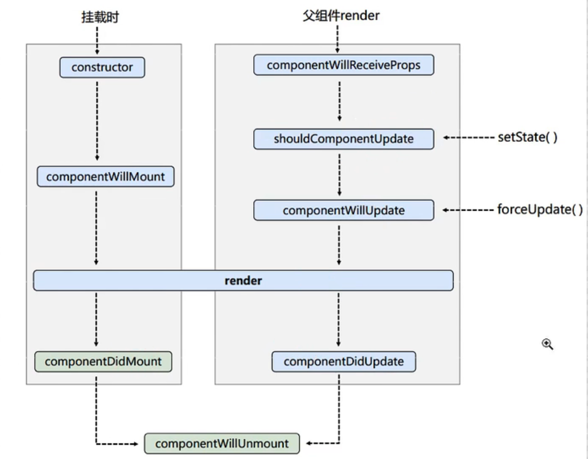
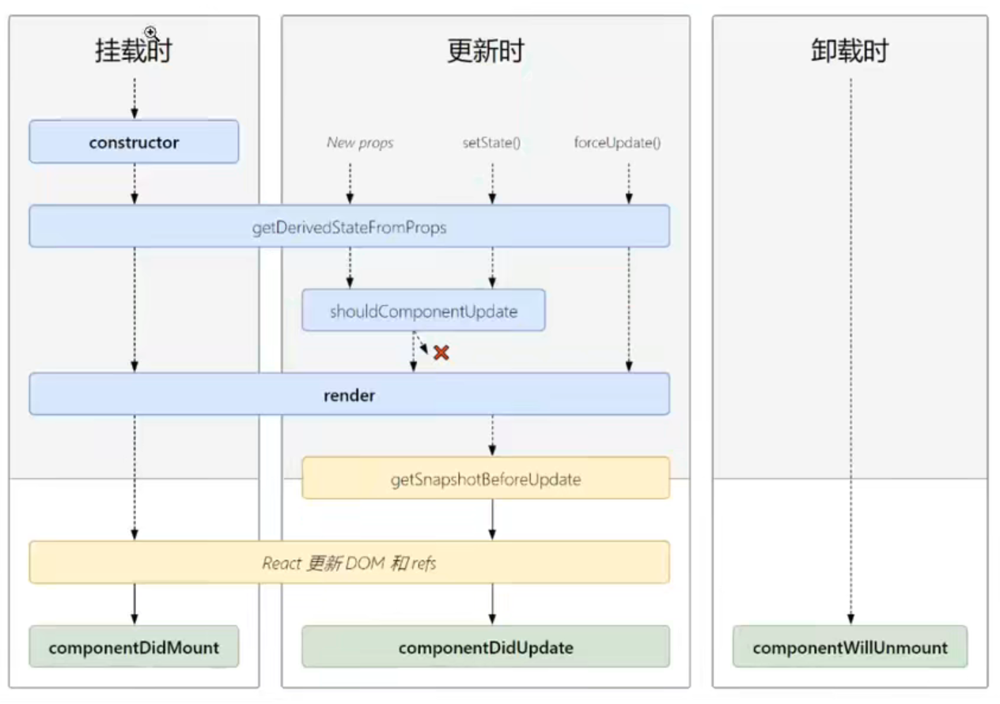

# 03-组件

### 函数组件

`目标任务:`   能够独立使用函数完成react组件的创建和渲染 `<br />`**定义：**

> 使用 JS 的函数（或箭头函数）创建的组件，就叫做 `函数组件`

```jsx
function HelloFn () {
  return <div>这是我的第一个函数组件!</div>
}

const root = ReactDOM.createRoot(document.getElementById("root"));
root.render(<HelloFn />);
```

注意：

1. 函数组件返回要渲染的内容(jsx)，可以换行，使用 `()`
2. 函数组件在作为reader函数的参数使用时，使用闭合的标签
3. 函数组件的首字母大写

即，函数式组件首字母大写、有返回值，在使用时作为闭合的标签使用

另：

render函数使用函数式组件时，先调用函数返回要渲染的解构

使用babel将jsx转换为js时，默认使用了严格模式，则此时函数组件的 `this = null`

#### 函数组件的事件绑定

基本格式：

on + 事件名称 = { 事件处理程序 } 

约定命名事件触发器为 onClick

事件处理函数为 handleClick


注意：此处的赋值，事件处理函数不能加 `() `

写在 `{}` 中的js表达式会直接执行，因此返回的是调用函数的返回值

不加 `() ` 只是拿到了函数对象本身，在事件触发时会调用

```jsx
// 函数组件
function HelloFn () {
  // 定义事件回调函数
  const handleClick = () => {
    console.log('事件被触发了')
  }
  return (
    // 绑定事件
    <button onClick={handleClick}>click me!</button>
  )
}
```


##### 获取事件对象：

```jsx
const handleClick = (e) => {
  console.log('事件被触发了', e)
}
```


##### 传递额外的参数：

如果直接添加参数列表：

```jsx
<button onClick={this.handleClick('123')}>click me</button>
```

此时，会直接调用函数clickHandler('123')，赋值给事件触发器的就是函数的返回值


因此，在响应函数赋值给事件触发器时，使用箭头函数包裹，此时箭头函数的返回值是一个函数

```jsx
<button onClick={(e) => this.handleClick(e, '123')}>click me</button>
```


### 类组件

`目标任务:`   能够独立完成类组件的创建和渲染

> 使用 ES6 的 class 创建的组件，叫做类（class）组件

```jsx
// 引入React
import React from 'react'

// 定义类组件
class HelloFn extends React.Component {
  render () {
    return <div>这是我的第一个类组件!</div>
  }
}

const root = ReactDOM.createRoot(document.getElementById("root"));
root.render(<HelloFn />);
```

注意：

1. 类组件继承 `React.Component`
2. 类组件必须实例化 `render()`
3. 类组件的命名首字母大写
4. 类组件在作为reader函数的参数使用时，使用闭合的标签

即，类组件首字母大写、继承 `React.Component`并实例化 `render`方法，在使用时作为闭合的标签使用

另：

在render渲染类组件时，先创建组件实例，并自动调用实例的 `render`方法

此时的 `render`函数 `this = 组件对象`


#### 类组件的事件绑定

在类组件中自定义方法，在方法中需要通过 `this` 访问组件中的信息

直接定义方法时，

```js
class St extends React.Component {
    demo() {
    const state = this.state.isHot;
  }
}
```

类中的方法默认开启了严格模式，所以this是undefined

有2种解决办法：

1. 在构造器中为函数绑定this
2. 函数定义为箭头函数，箭头函数没有this，因此在上层作用域（实例对象）中调用this


```js
class St extends React.Component {
  constructor(props) {
    super(props);
    this.state = { isHot: true, win: "ss" };
    // 解决类中方法的 this = undefined 的方法，主动绑定this为实例对象
    // this.demo1 = this.demo.bind(this);
  }

  demo() {
    //类中的方法默认开启了严格模式，所以this是undefined
    const state = this.state.isHot;
    //必须使用setState对其进行修改，并且这是一个合并
    this.setState({ isHot: !state });
  }

  //render会调用1+n次【1就是初始化的时候调用的，n就是每一次修改state的时候调用的】
  render() {
    return (<h1 onClick={() => this.demo}>
        今天天气很{this.state.isHot ? "炎热" : "凉爽"}</h1>)
  }
  //通过实例调用render时，this就是实例对象
}
```

类组件的简化写法：

```js
class St extends React.Component {
  // 可以直接对其进行赋值，此时state作为实例对象的一个属性
  state = { isHot: true };
  render() { //此处this是实例对象
    return (<h1 onClick={() => this.demo()}>
        今天天气很{this.state.isHot ? "炎热" : "凉爽"}</h1>)
  }
  // 箭头函数 [自定义方法--->要用赋值语句的形式+箭头函数]
  // 在render中通过this调用方法时，箭头函数没有this，
  // 会向上层作用域找this，自然找到实例对象的this
  demo = () => {
    console.log(this);
    const state = this.state.isHot;
    this.setState({ isHot: !state });
  }
}
```


小结：

1. 本质上state是类组件的一个实例属性，可以不通过 `constructer` 声明
2. 类组件中，自定义方法通过写成箭头函数的形式，避免this==undefined


### 关于函数组件与实例组件的3大属性

注意：state，refs，props是类组件的3大属性

函数组件没有this，不能通过this访问refs，state；只能使用props

```js
function fn(props) {
  // 传入的所有参数在props对象中
  console.log(props)
  return (
    <ul>
      <li>{props.name}</li>
      <li>{props.age}</li>
      <li>{props.sex}</li>
    </ul>
  )
}
ReactDOM.render(<Person name="sss" age = {14} speak="8"/>,
    document.getElementById("div"));
```

函数式组件要使用state，refs需要hook

### 组件状态（state）

描述组件的状态 -> 即存储组件的数据，用于展示

> 简单组件：没有状态的组件
>
> 复杂组件：有状态的组件


```js
class Counter extends React.Component {
  // 定义数据
  state = {
    count: 0
  }
  // 定义修改数据的方法
  setCount = () => {
    this.setState({
      count: this.state.count + 1
    })
  }
  // 使用数据 并绑定事件
  render () {
    return <button onClick={this.setCount}>{this.state.count}</button>
  }
}
```


### props

```js
class Person extends React.Component {
  render() {
    //props是只读的
    return (
      <ul>
        <li>{this.props.name}</li>
        <li>{this.props.age}</li>
        <li>{this.props.sex}</li>
      </ul>
    )
  }
  //对组件的属性对其进行限制
  static propTypes = {
    name: PropTypes.string.isRequired,
    sex: PropTypes.string,
    speak: PropTypes.function
  }
  //指定默认的标签属性
  static defaultProps = {
    sex: "女",
    age: 18
  }
}
```

小结：

1. props只读
2. 利用类的静态方法实现props的类型限制和默认值


### refs

实际是用于获取真实DOM节点的

#### 字符串式（过时）

直接给标签添加属性 `ref=name` 此时可以通过 `this.refs.name` 获取对应的节点

```js
class Dom extends React.Component {
  btnOnClick = () => {
    alert(this.refs.input.value);
  }
  render() {
    return (
      <div>
        <input ref="input" type="text" placeholder="点击弹出" />&nbsp;
        <button onClick={this.btnOnClick}>点击</button>&nbsp;
      </div>
    )
  }
}
```


#### 回调形式

此时 ref = {函数} 其传入函数的参数是对应的DOM节点

此时可以把节点对象赋给任意变量

```js
class Dom extends React.Component{

  state = {isHot:true};
  btnOnClick = () =>{
      alert(this.dian.value);
  }
  btnOnClick2 = () =>{
      this.setState({isHot:!this.state.isHot});
  }
  isRef = (self) =>{
      console.log(self);
      this.dian = self;
      console.log("sss")
  }
  render(){
      //回调形式的ref 在ref中执行回调函数，将自身作为参数传递给回调函数
      return (
          <div>
          <input ref={this.isRef} type="text" placeholder="点击弹出" />&nbsp;
              <button onClick = {this.btnOnClick}>点击</button>&nbsp;
              <button onClick = {this.btnOnClick2}>点击</button>&nbsp;
          </div>
      )
  }
}
```

内联式：

```js
<input 
	ref={self =>{ this.dian = self;console.log(self)}}
	type="text" 
	placeholder="点击弹出" />;
```

此时函数直接写在标签内，但每次更新节点调用render函数时，对应的函数会调用2次（但无关紧要）


仅传入函数对象可以避免

```js
<input ref={this.isRef} type="text" placeholder="点击弹出" />;
```


#### createRef

此时，每个createRef只能接收一个DOM节点

给一个createRef 重复赋值，后添加的会覆盖之前的

```js
class Dom extends React.Component {
  MyRef1 = React.createRef();
  MyRef2 = React.createRef();

  btnOnClick = () => {
    //创建之后，将自身节点，传入current中
    console.log(this.MyRef1.current.value);
    //alert(this.refs.dian.value);
  }
  inputBlur = () => {
    //alert(this.MyRef2.current.value);
  }
  render() {
    return (
      <div>
        <input ref={this.MyRef} type="text" placeholder="点击弹出" />&nbsp;
        <button onClick={this.btnOnClick}>点击</button>&nbsp;
        <input ref={this.MyRef1} 
			onBlur={this.inputBlur} 
			type="text" 
			placeholder="失去焦点弹出弹出" />
	  </div>
    )
  }
}
```


### 事件处理

1. 通过 `onXxx` 属性指定事件处理函数
    - React中使用自定义的事件（onClick），不适用原生事件（onclick）---兼容性
    - React中的事件是通过事件委托方式处理的（委托给组件最外层元素）---高效
2. 通过 event.target 得到事件源的DOM --- 不要过度使用ref

例：当事件源与需要获取DOM节点的标签是同一个时，可以通过event.target获取DOM，不适用ref


### 关于构造器

在构造器中仅进行2个任务

1. 给state初始化
2. 为事件处理函数绑定实例对象

因：

1. state的初始化可以直接在类中进行
2. 事件处理函数写成箭头函数的形式也可以得到指向实例的this

所以构造器可以省略


另：向构造器传入props的影响：

```js
class Person extends React.Component{
  constructor(props) {
    super(props)
    console.log("this.props",this.props)
    console.log("props",props)
  }
}
```

传入props并给super调用，仅可以使 `this.props` 有值

不将props传入super，`this.props == undefined` 

但事实上，在构造器中可以直接通过props访问，在其它处可以访问this.props


### 表单处理

React中的组件分为

将状态变化交由React处理的组件

和通过ref引用获取的组件两种，

前者称为受控组件，后者称为非受控组件


#### 受控组件（建议使用）

什么是受控组件？  `input框自己的状态被React组件状态控制`

React组件的状态的地方是在state中，input表单元素也有自己的状态是在value中，React将state与表单元素的值（value）绑定到一起，由state的值来控制表单元素的值，从而保证单一数据源特性


vue的双向绑定：传入的参数在组件内部动态绑定；同时组件内对数据的改变可以引起外部参数对应变量的改变

react的受控组件，将变化由react管理的组件

以受控表单为例：

```js
class InputComponent extends React.Component {
  // 声明组件状态
  state = {
    message: 'this is message',
  }
  // 声明事件回调函数
  changeHandler = (e) => {
    this.setState({ message: e.target.value })
  }
  render () {
    return (
      <div>
        {/* 绑定value （state变化引发input变化） 绑定事件（input变化修改state的值）*/}
        <input value={this.state.message} onChange={this.changeHandler} />
      </div>
    )
  }
}
```


#### 非受控组件（不建议）

什么是非受控组件？

非受控组件就是通过手动操作dom的方式获取文本框的值，文本框的状态不受react组件的state中的状态控制，直接通过原生dom获取输入框的值

```js
class InputComponent extends React.Component {
  // 使用createRef产生一个存放dom的对象容器
  msgRef = createRef()

  changeHandler = () => {
    console.log(this.msgRef.current.value)
  }

  render() {
    return (
      <div>
        {/* ref绑定 获取真实dom */}
        <input ref={this.msgRef} />
        <button onClick={this.changeHandler}>click</button>
      </div>
    )
  }
}
```


#### 小结

1. `React`中的组件分为受控组件和非受控组件
2. 受控组件的两个要点：
   - 组件的`value`属性与`React`中的状态绑定
   - 组件内声明了`onChange`事件处理`value`的变化
3. 非受控组件更像是传统的`HTML`表单元素，数据存储在`DOM`中，而不是组件内部，获取数据的方式是通过`ref`引用
4. 一些建议：
   - 尽可能使用受控组件
   - 受控组件是将状态交由`React`处理，可以是任何元素，不局限于表单元素
   - 对于有大量表单元素的页面，使用受控组件会使程序变得繁琐难控，此时使用非受控组件更为明智
   - 在受控组件中，数据流是单向的(`state`是变化来源)，因此在改变`state`时都应该使用`setState`，而不要强制赋值
   - `Refs`不能用于函数式组件，因为函数式组件没有实例
   - 在函数式组件内部，是可以使用`Refs`的

作者：卷帘依旧
链接：https://juejin.cn/post/7020980474025607205
来源：稀土掘金

### 生命周期（旧v16.8.4）

$\textcolor{red}{react \ v16.8.4}$  




初始化：

1. constructor()
2. componentWillMount()
3. render()
4. componentDidMount()

更新：3种情况：

1. setState()触发更新：
   1. setState()
   2. shouldComponentUpdate()返回true则继续，返回false则停止
   3. componentWillUpdate()
   4. render()
   5. componentDidUpdate()
2. this.forceUpdate()触发
   1. this.forceUpdate()
   2. componentWillUpdate()
   3. render()
   4. componentDidUpdate()
3. 父组件render触发
   1. 父组件render（注意：此处仅当父组件首次render不触发）
   2. componentWillReceiveProps()
   3. shouldComponentUpdate()返回true则继续，返回false则停止
   4. componentWillUpdate()
   5. render()
   6. componentDidUpdate()

卸载组件：

1. componentWillUnmount()


其中常用的：

1. render() 必须使用
2. componentDidMount()
   - 初始化，如：开始计时器、发送网络请求、订阅消息
3. componentWillUnmount()
   - 收尾，如：停止计时器、取消（正在发送的）网络请求、取消订阅


### 生命周期（新v17.0.1）

删除了3个（仍能使用，17版本有警告，需要加 UNSAFE_ 前缀）

- componentWillMount()
- componentWillReceiveProps()
- componentWillUpdate()

新增了2个

- getDerivedStateFromProps()
- getSnapshotBeforeUpdate()





```js
static getDerivedStateFromProps(props, state) {
  console.log("A --- getDerivedStateFromProps", props);
  return null;
}
```

参数： 第一个参数为即将更新的 `props`, 第二个参数为上一个状态的 `state` 

返回值：返回一个对象来更新 `state`, 如果返回 `null` 则不更新任何内容

此函数在初始化挂在或，任意更新前都会调用，因此，若返回固定的state，则其中对应的属性不能再更改

小结：

- 必须是静态的
- 必须有返回值（Null或者state对象）
  如果返回的是state对象，将调用setState方法进行更新，且每次都会调用

```js
getSnapshotBeforeUpdate(prevProps, prevState){
  return this.refs.list.scrollHeight;
}

componentDidUpdate(prevProps,prevState,snapshot){
  this.refs.list.scrollTop += (this.refs.list.scrollHeight - height);
}
```

getSnapshotBeforeUpdate(prevProps, prevState)

参数：第一个是上一次props值。 第二个是上一次state值。

返回值：会作为参数snapshot传入componentDidUpdate(prevProps,prevState,snapshot)

应用：

用于获取上次的scrollHeight，自动修改scrollTop

使得在上方插入内容后，保持视口显示当前内容的位置不变


### diff算法（key的作用）

面试题：react/vue中key有什么作用


虚拟DOM中key的作用：

1. key是虚拟DOM的标识，在更新显示时起作用
2. 状态中的数据发生变化时，react会根据【新数据】生成【新的虚拟DOM】，随后进行【新虚拟DOM】与{旧虚拟DOM】的diff比较，规则如下：
   1. 【旧虚拟DOM】中有与【新虚拟DOM】key相同的标签：
      1. 若虚拟DOM的内容一致，直接使用【旧真实DOM】
      2. 若虚拟DOM的内容改变，生成【新真实DOM】并替换
   2. 【旧虚拟DOM】中未找到与【新虚拟DOM】key相同的标签：
      1. 根据【新虚拟DOM】的数据创建【新真实DOM】


用index作为key可能引发的问题：

1. 若对数据进行【逆序】添加、【逆序】删除等【破坏顺序】的操作，此时旧虚拟DOM中有与新虚拟DOM中【内容相同但key不同】的节点，会重新生成，造成效率低
2. 结构中包含输入的DOM，产生错误的DOM更新（输入内容与可以匹配但key发生变化）
3. 但，若不对数据进行【逆序】等破坏顺序的操作，仅用于渲染显示，没有问题